## Task 1: Mevcut Paketleri Keşfetme ve Kurulum

### Görev
ArtifactHub üzerinden resmi bir nginx chart'ı bulup Minikube üzerine kurun.

### Yapılan İşlemler

#### 1. Bitnami Repository Ekleme
```bash
helm repo add bitnami https://charts.bitnami.com/bitnami
helm repo update
```

#### 2. Nginx Chart Kurulumu
```bash
helm install my-nginx bitnami/nginx --namespace default
```

#### 3. Kurulum Doğrulama
```bash
helm list
kubectl get pods
```

### helm status Çıktısı
```
NAME: my-nginx
LAST DEPLOYED: Wed Jan 14 06:24:02 2026
NAMESPACE: default
STATUS: deployed
REVISION: 1

NOTES:
CHART NAME: nginx
CHART VERSION: 22.4.3
APP VERSION: 1.29.4

** Please be patient while the chart is being deployed **

NGINX can be accessed through the following DNS name from within your cluster:
    my-nginx.default.svc.cluster.local (port 80)
```

### Soru: helm status komutundaki "Notes" bölümü ne işe yarar?

Notes bölümü `chartName/templates/NOTES.txt` dosyasındaki bilgileri gösterir ve şu amaçlara hizmet eder:

1. **Kurulum Sonrası Talimatlar**: Uygulamaya nasıl erişileceğini gösterir
2. **Bağlantı Bilgileri**: Service URL'leri ve port bilgileri
3. **Önemli Uyarılar**: Güvenlik ve yapılandırma notları
4. **Chart Metadata**: Chart adı, versiyonu ve uygulama versiyonu

### Port Forwarding ile Erişim
```bash
kubectl port-forward svc/my-nginx 8080:80
```


---

## Task 2: Yapılandırma ve Values.yaml

### Görev
Kurulu nginx uygulamasının özelliklerini values.yaml dosyası üzerinden özelleştirin.

### Başlangıç Durumu
Varsayılan kaynak limitleri:
```yaml
resources:
  limits:
    cpu: 150m
    ephemeral-storage: 2Gi
    memory: 192Mi
  requests:
    cpu: 100m
    ephemeral-storage: 50Mi
    memory: 128Mi
```

### Yapılan Değişiklikler

#### 1. values.yaml Güncelleme
```yaml
replicaCount: 3

resources:
  limits:
    cpu: "1"
    memory: "2Gi"
  requests:
    cpu: "500m"
    memory: "1Gi"
```

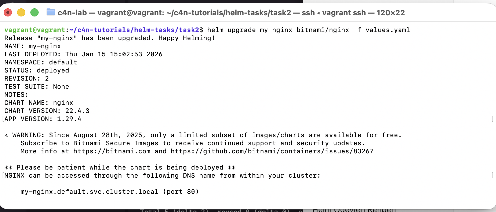

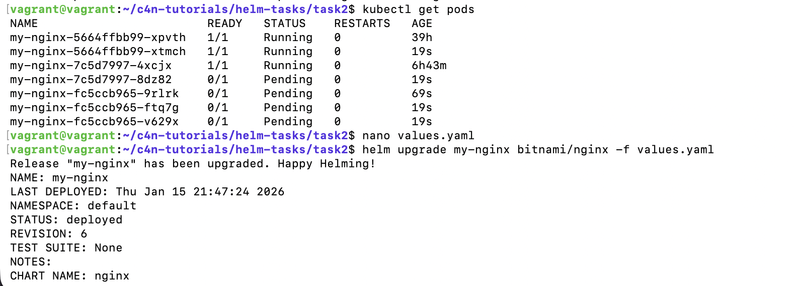

#### 2. Helm Upgrade
```bash
helm upgrade my-nginx ./nginx
```

### Sonuç ve Gözlemler

Upgrade sonrası bazı pod'lar "Pending" durumunda kaldı. Bu durum Minikube'un tek node üzerinde çalışması ve belirlenen kaynak gereksinimlerini karşılayacak yeterli kapasitesinin olmamasından kaynaklanıyor.

```
0/1 nodes are available: insufficient cpu.
```

Bu durum bir hata değil, Kubernetes'in kaynak yönetiminin doğru çalıştığının göstergesi.

---

## Task 3: Kendi Chart'ını Oluşturma (Deep Dive)

### Görev
Flask ile basit bir "Hello World" uygulamasını Helm Chart haline getirin.

### Yapılan İşlemler

#### 1. Flask Uygulaması
```python
from flask import Flask
app = Flask(__name__)

@app.route('/')
def hello():
    return "Hello World! Kubernetes ve Helm çalışıyor"

if __name__ == '__main__':
    app.run(host='0.0.0.0', port=5000)
```

#### 2. Dockerfile
```dockerfile
FROM python:3.9-slim
WORKDIR /app
RUN pip install flask
COPY app.py .
EXPOSE 5000
CMD ["python", "app.py"]
```

#### 3. Image Build (Minikube Docker)
```bash
eval $(minikube docker-env)
docker build -t my-hello-app:v1.0.0 .
```

#### 4. Helm Chart Oluşturma
```bash
helm create hello-app
```

#### 5. Chart Deployment
```bash
helm install hello-world-app ./hello-app --set image.pullPolicy=Never
```

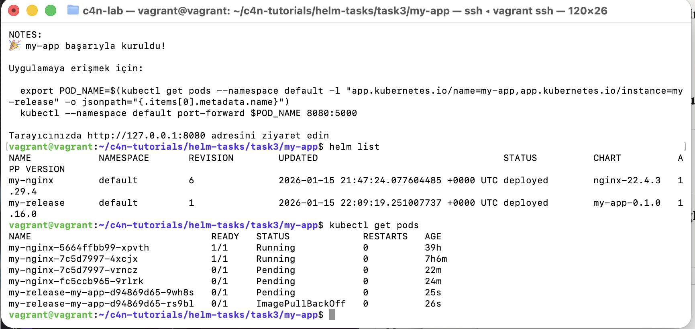


### Karşılaşılan Sorun: ImagePullBackOff

İlk denemede `ImagePullBackOff` hatası alındı çünkü image VM'nin Docker daemon'ında build edilmişti, Minikube'nin Docker daemon'ında değil.

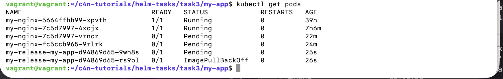

**Çözüm:** `eval $(minikube docker-env)` komutu ile Minikube'nin Docker daemon'ına geçip image'ı orada build etmek.

---

## Task 4: Release Yönetimi ve Geri Dönüş (Rollback)

### Görev
Uygulamanın imaj versiyonunu bilerek hatalı bir versiyonla güncelleyip rollback yapın.

### Yapılan İşlemler

#### 1. Hatalı Upgrade
values.yaml'da `nginx` yerine `nginxx` yazarak kasıtlı hata oluşturuldu.

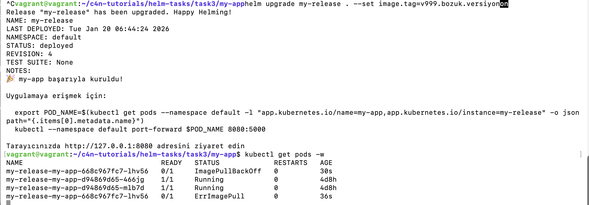

#### 2. Hata Gözlemi
Pod'lar `ImagePullBackOff` durumuna geçti.

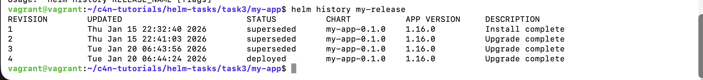

#### 3. Rollback İşlemi
```bash
helm history my-nginx
helm rollback my-nginx 1
```

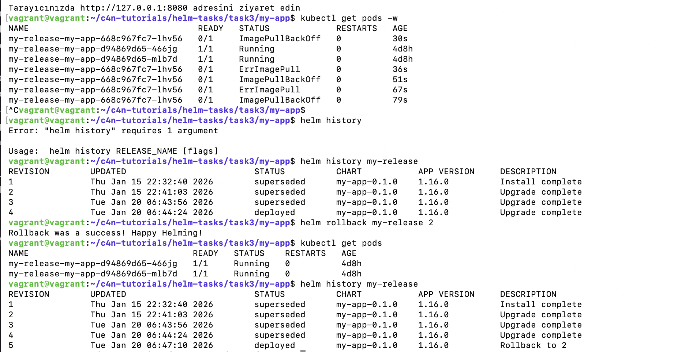

Rollback sonrası pod'lar tekrar çalışır duruma geldi.

---

## Task 5: Final Projesi (Full Stack)

### Görev
WordPress sitesini MariaDB ile birlikte Helm kullanarak kurun ve Secret objesi ile güvenli deployment yapın.

### Yapılan İşlemler

#### 1. WordPress Chart İndirme
```bash
helm pull bitnami/wordpress --untar
```

#### 2. Secret Template Oluşturma
`templates/externaldb-secret.yaml`:
```yaml
apiVersion: v1
kind: Secret
metadata:
  name: {{ include "wordpress.fullname" . }}-db-secret
type: Opaque
data:
  mariadb-password: {{ .Values.mariadb.auth.password | b64enc | quote }}
  wordpress-password: {{ .Values.wordpress.auth.password | b64enc | quote }}
```

#### 3. values.yaml Güncelleme
MariaDB ayarları external secret kullanacak şekilde güncellendi.

#### 4. WordPress Deployment
```bash
helm install my-blog ./wordpress
```

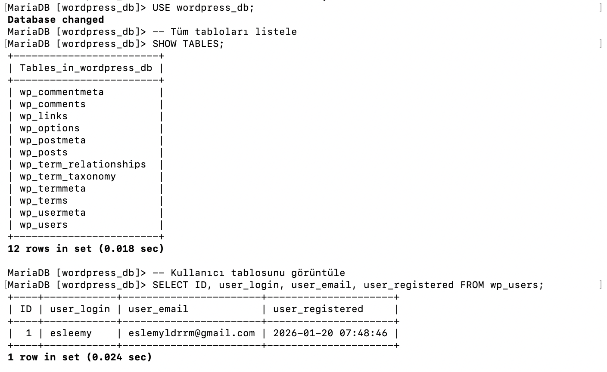

#### 5. Secret Doğrulama
Secret objesi base64 ile şifrelenmiş şifreleri içeriyor.

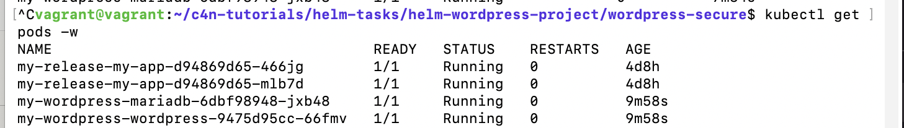

#### 6. HTTPS Yapılandırması
Self-signed sertifika oluşturuldu:
```bash
openssl req -x509 -nodes -days 365 -newkey rsa:2048 \
-keyout tls.key \
-out tls.crt \
-subj "/CN=my-blog.local/O=Lab"
```

values.yaml'da TLS ayarları güncellendi ve WordPress HTTPS ile erişilebilir hale getirildi.


#### 7. Port Forwarding ile Erişim
```bash
kubectl port-forward svc/my-blog-wordpress 8080:80 --address 0.0.0.0
```

#### 8. HTTPS Erişim Testi
WordPress HTTPS üzerinden başarıyla erişilebilir hale geldi:

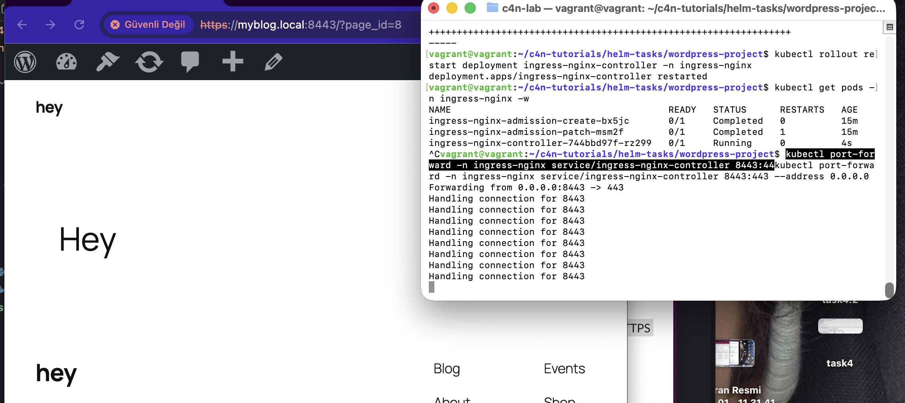

### Karşılaşılan Sorun: VM Kapanması
Çalışma sırasında VM beklenmedik şekilde kapandı. Emergency stop yapılarak sistem yeniden başlatıldı.

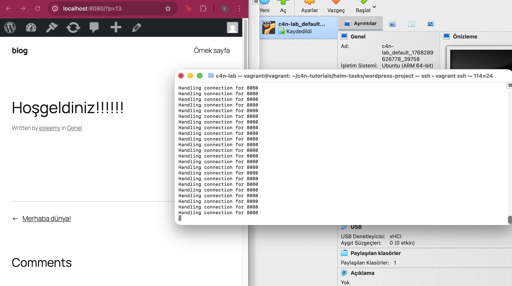

**Çözüm:**
```bash
vagrant up
minikube start
helm list  # Release'leri kontrol et
```

---

## Öğrenilen Kavramlar

### Helm Temel Kavramları
- **Chart**: Kubernetes uygulamalarını tanımlayan dosya koleksiyonu
- **Release**: Bir chart'ın Kubernetes cluster'ında çalışan instance'ı
- **Repository**: Chart'ların depolandığı yer
- **values.yaml**: Chart'ı özelleştirmek için kullanılan yapılandırma dosyası

### Kubernetes Entegrasyonu
- **Secret**: Hassas verilerin güvenli saklanması
- **PersistentVolumeClaim**: Kalıcı veri depolama
- **Service Discovery**: Container'ların birbirini bulması
- **Resource Management**: CPU ve memory limitleri

### Operasyonel Kavramlar
- **helm upgrade**: Mevcut release'i güncelleme
- **helm rollback**: Önceki versiyona geri dönme
- **helm history**: Release geçmişini görüntüleme
- **ImagePullPolicy**: Container image çekme politikaları
- **Emergency Recovery**: Sistem kurtarma prosedürleri
