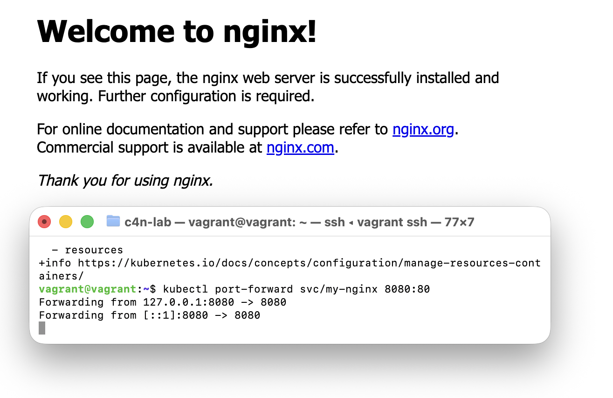

# Task 1: Helm ile Nginx Kurulumu

## Amaç
ArtifactHub üzerinden resmi bir nginx chart'ı bulup Minikube üzerine kurmak.

## Yapılan Adımlar

### 1. Bitnami Reposunu Helm'e Ekleme
```bash
helm repo add bitnami https://charts.bitnami.com/bitnami
helm repo update
```

### 2. Nginx Uygulamasını Kurma
```bash
helm install my-nginx bitnami/nginx
```

### 3. Durumu Kontrol Etme
```bash
helm list
```

## Soru ve Cevap

**Soru:** `helm status` komutu çıktısındaki "Notes" bölümü ne işe yarar?

**Cevap:** `helm status <release-name>` komutunun çıktısındaki "Notes" bölümü şu amaçlara hizmet eder:

1. **Kurulum Sonrası Talimatlar**: Uygulamayı nasıl erişilebilir hale getireceğinizi gösterir (port-forward, LoadBalancer IP alma vb.)

2. **Bağlantı Bilgileri**: Uygulamaya nasıl bağlanacağınızı, hangi URL veya port üzerinden erişeceğinizi belirtir

3. **Varsayılan Credentials**: Eğer uygulama şifre gerektiriyorsa, varsayılan kullanıcı adı/şifre bilgilerini veya bunları nasıl alacağınızı gösterir

4. **Önemli Uyarılar**: Güvenlik veya yapılandırma ile ilgili önemli notları içerir

### Örnek Notes Çıktısı (Nginx için):
```
NOTES:
** Please be patient while the chart is being deployed **

NGINX can be accessed through the following DNS name from within your cluster:
    my-nginx.default.svc.cluster.local (port 80)

To access NGINX from outside the cluster, follow the steps below:
1. Get the NGINX URL by running these commands:
   kubectl port-forward --namespace default svc/my-nginx 8080:80
   echo "NGINX URL: http://127.0.0.1:8080/"
```

## Kullanılan Komutlar Özeti
```bash
# Repo ekleme
helm repo add bitnami https://charts.bitnami.com/bitnami

# Repo güncelleme
helm repo update

# Nginx kurulumu
helm install my-nginx bitnami/nginx

# Release listesi
helm list

# Release durumu
helm status my-nginx
```

## Port Forwarding ile Erişim

Minikube'da LoadBalancer olmadığı için port-forward ile uygulamaya erişim sağlandı:

```bash
kubectl port-forward svc/my-nginx 8080:80
```

### Port Forward Çıktısı:
```
vagrant@vagrant:~$ kubectl port-forward svc/my-nginx 8080:80
Forwarding from 127.0.0.1:8080 -> 8080
Forwarding from [::1]:8080 -> 8080
```

### Tarayıcı Sonucu:
Ardından tarayıcıdan `http://localhost:8080` adresine gidildi ve nginx başarıyla çalıştığı görüldü:



> **Welcome to nginx!**
> 
> If you see this page, the nginx web server is successfully installed and working. Further configuration is required.
> 
> For online documentation and support please refer to nginx.org.
> Commercial support is available at nginx.com.
> 
> *Thank you for using nginx.*
